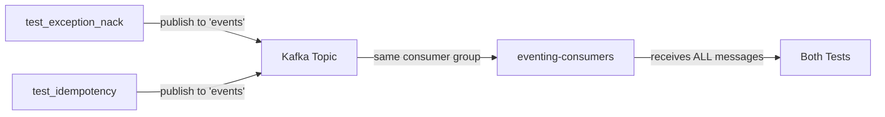
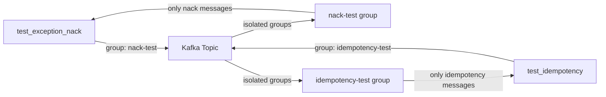

# Fix remaining GitHub Actions test failures

## Current status

**Linters**: All passing ✓
**Tests**: 7 failures
- 6 unit test failures (mock parameter ordering)
- 1 integration test failure (test isolation)

## Root causes identified

### Issue 1: Unit test mock parameter ordering (6 failures)

**Location**: [`tests/unit/test_initialization_unit.py`](tests/unit/test_initialization_unit.py)

Python applies decorators bottom-to-top, but parameters are received in application order. Three tests have reversed parameter names:

```python
# Line 47-50: WRONG parameter order
@patch("messaging.infrastructure.pubsub.rabbit_broker_config.create_rabbit_broker")  # 2nd
@patch("messaging.infrastructure.create_kafka_broker")  # 1st
def test_passes_settings_to_kafka_broker(
    self, mock_create_rabbit, mock_create_kafka  # REVERSED - should be kafka, rabbit
) -> None:
```

**Affected tests** (lines 49-50, 67-68, 92-93):
- `test_passes_settings_to_kafka_broker`
- `test_passes_rate_limiter_settings`
- `test_rabbit_publisher_uses_correct_exchange`

### Issue 2: Kafka consumer group isolation (1 failure)

**Location**: [`tests/integration/test_bridge_handler_integration/test_idempotency.py`](tests/integration/test_bridge_handler_integration/test_idempotency.py)

Tests share the same Kafka consumer group ("eventing-consumers"), causing message cross-contamination:
- `test_exception_nack` publishes message with event_id "exception-test-{uuid}"
- `test_idempotency` receives BOTH its own message AND the exception test message
- Assertion fails: `assert len(messages_received) == 1` but gets 2

**Current architecture**:


**Root cause**: Consumer group ID hardcoded in [`src/messaging/main/_initialization/bridge_setup/handler_registration.py:33`](src/messaging/main/_initialization/bridge_setup/handler_registration.py):

```python
@broker.subscriber(
    bridge_config.kafka_topic,
    ack_policy=AckPolicy.MANUAL,
    group_id="eventing-consumers",  # HARDCODED
)
```

## Implementation plan

### Phase 1: Fix unit test mock parameter ordering

**Files to modify**:
- [`tests/unit/test_initialization_unit.py`](tests/unit/test_initialization_unit.py)

**Changes**:
1. Line 50: Change `self, mock_create_rabbit, mock_create_kafka` to `self, mock_create_kafka, mock_create_rabbit`
2. Line 68: Same parameter swap
3. Line 93: Same parameter swap

**Method**: Use Serena MCP `replace_symbol_body` or direct string replacement.

### Phase 2: Make Kafka consumer group configurable

**Architecture after fix**:


**Files to modify**:

1. **[`src/messaging/infrastructure/pubsub/bridge/config.py`](src/messaging/infrastructure/pubsub/bridge/config.py)**
   - Add `consumer_group_id: str` field to `BridgeConfig` dataclass

2. **[`src/messaging/main/_initialization/bridge_setup/config.py`](src/messaging/main/_initialization/bridge_setup/config.py)**
   - Pass `consumer_group_id="eventing-consumers"` as default when creating `BridgeConfig`

3. **[`src/messaging/main/_initialization/bridge_setup/handler_registration.py`](src/messaging/main/_initialization/bridge_setup/handler_registration.py)**
   - Change hardcoded `group_id="eventing-consumers"` to use `bridge_config.consumer_group_id`

4. **[`tests/integration/test_bridge_handler_integration/setup_helpers.py`](tests/integration/test_bridge_handler_integration/setup_helpers.py)**
   - Add optional `consumer_group_id` parameter to `setup_test_containers_config()`
   - Return it as third element in tuple

5. **[`tests/integration/test_bridge_handler_integration/test_idempotency.py`](tests/integration/test_bridge_handler_integration/test_idempotency.py)**
   - Pass `consumer_group_id="idempotency-test-group"` to setup function
   - Pass it to `initialize_production_bridge()`

6. **[`tests/integration/test_bridge_handler_integration/test_exception_nack.py`](tests/integration/test_bridge_handler_integration/test_exception_nack.py)**
   - Pass `consumer_group_id="exception-nack-test-group"` to setup function
   - Pass it to `initialize_production_bridge()`

**Method**: Use Serena MCP for all manipulations:
- `activate_project` first
- `replace_symbol_body` for dataclass and function modifications
- `find_referencing_symbols` to verify no breaking changes

### Phase 3: Verification

1. Run linters locally to confirm no new violations
2. Run failing tests locally to verify fixes
3. Commit with message: `fix(tests): resolve mock parameter ordering and consumer group isolation`
4. Push and monitor GitHub Actions

## Critical notes

- **Use Serena MCP exclusively** for code manipulation as requested
- **Preserve all existing functionality** - only add consumer_group_id parameter
- **Default value** for consumer_group_id ensures backward compatibility
- **Test isolation** is achieved by using unique consumer group per test
- **No trimming or formatting changes** during refactoring