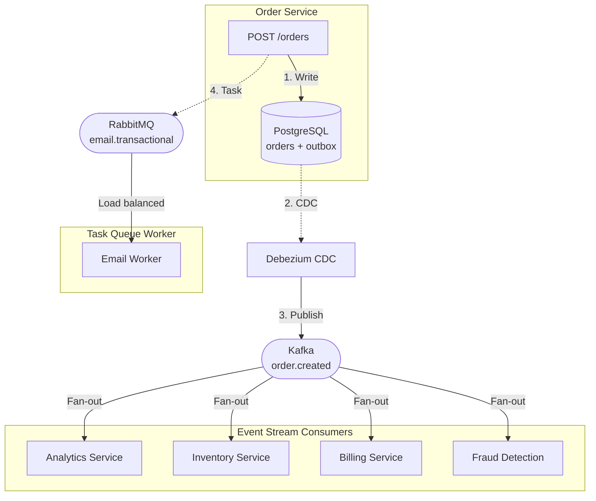

# Broker selection guide

> **🎯 Industry Best Practice (Uber/Zalando):**
>
> *"For the growing number of organizations whose needs span both categories, the pragmatic approach is to run both brokers, using Kafka for event streaming and RabbitMQ for task queuing and routing. This dual-broker pattern is employed by companies like Uber and Zalando."*
>
> **— Tech Insider 2026, Kafka vs RabbitMQ Industry Analysis**

**[Pattern Overview](#recommended-pattern-choose-at-publish-time)** • **[Event Streaming vs Task Queuing](#event-streaming-vs-task-queuing)** • **[When to Use](#when-to-use-each-broker)** • **[Real-World Example](#real-world-example-e-commerce-service)**

## Overview: Dual-broker architecture

This service supports **dual-broker architecture** - the industry-standard pattern used by **Uber, Zalando**, and modern microservices.

**Two patterns available:**
1. **Pattern 1 (Recommended):** Choose broker at publish time - 78/100 rating
2. **Pattern 2 (Optional):** Bridge component (Kafka → RabbitMQ) - 65/100 rating

**⚠️ Most architectures don't need a bridge.** Use Pattern 1 for new systems.

---

## Recommended: Pattern 1 - Choose at publish time

**Services make conscious architectural choice per use case:**

```python
# KAFKA (via outbox + CDC): Event streaming
await outbox_repo.add_event(OrderCreated(...), session=session)
# → Multiple consumers, replay capability, ACID guarantees

# RABBITMQ (direct): Task queues
await rabbit_publisher.publish(SendEmailTask(...), routing_key="email.high")
# → One worker, priority support, low latency, deleted after processing
```

**Characteristics:**
- **No bridge component** - Services choose directly at publish time
- **Right tool for each job** - Kafka for events, RabbitMQ for tasks
- **Used by:** Uber, Zalando, and modern microservice architectures
- **Rating:** 78/100

---

## Event streaming vs task queuing

**Critical distinction:** Debezium + Kafka solves **event streaming**, but RabbitMQ excels at **task queuing**. These are fundamentally different architectural patterns.

### Event Streaming Pattern (Kafka + Debezium)

**Semantic:** "Something happened in the past" (immutable fact)

```python
# KAFKA: Event for analytics, audit, inventory
await outbox_repo.add_event(
    OrderCreated(
        aggregate_id=f"order-{order.id}",
        order_id=order.id,
        user_id=user.id,
        items=order.items,
        total=100.00,
        timestamp=datetime.now(UTC)
    ),
    session=session
)

# ↓ Debezium CDC → Kafka topic "order.created"
# ↓
# MULTIPLE consumers react (fan-out):
# 1. Analytics service → Stores for business intelligence reports
# 2. Inventory service → Reserves stock for ordered items
# 3. Billing service → Creates invoice and payment record
# 4. Fraud detection → Checks order patterns
# 5. Audit service → Compliance log (immutable trail)
```

**Characteristics:**
- ✅ **Multiple consumers** - Many services react to same event (fan-out)
- ✅ **Event history preserved** - Events stored for days/weeks
- ✅ **Replay capability** - New service can process historical events
- ✅ **Immutable facts** - Events never change
- ✅ **Ordering guarantees** - Same partition key → FIFO order
- ⚠️ **Infrastructure complexity** - Requires outbox table + Debezium CDC
- ⚠️ **Higher latency** - 5-100ms (due to CDC, acceptable)

**When to use:**
- Domain events (OrderCreated, UserRegistered, PaymentProcessed)
- Audit trails and compliance logs
- Analytics and business intelligence
- Event sourcing architectures
- Multiple downstream services need same data

### Task Queuing Pattern (RabbitMQ Direct)

**Semantic:** "Do this work now" (command with single receiver)

```python
# RABBITMQ: Task for immediate execution
await rabbit_publisher.publish(
    SendEmailTask(
        recipient="user@example.com",
        template="welcome_email",
        priority="high",
        retry_count=3
    ),
    routing_key="email.high"  # Priority routing
)

# ↓ RabbitMQ exchange "tasks"
# ↓
# ONE worker picks up task (load balanced):
# Email worker → Sends email, marks done
#
# Task DELETED after processing (no history)
# Cannot replay (fire-and-forget command)
```

**Characteristics:**
- ✅ **Single consumer** - Exactly one worker handles task (load balancing)
- ✅ **Low latency** - Direct publish, no outbox overhead (~1-5ms)
- ✅ **Priority support** - High-priority tasks jump queue
- ✅ **Deleted after processing** - No storage waste on completed tasks
- ✅ **Simple infrastructure** - No outbox table, no CDC required
- ⚠️ **No replay** - Completed tasks cannot be reprocessed
- ⚠️ **Single transaction boundary** - Task processing separate from producer

**When to use:**
- Background jobs (send email, generate PDF, resize image)
- Notifications and alerts
- Scheduled tasks and cron jobs
- Worker pools and job queues
- One-off commands (not events for multiple consumers)

### Comparison Table

| Aspect | Event Streaming (Kafka) | Task Queuing (RabbitMQ) |
|--------|-------------------------|-------------------------|
| **Semantic** | "This happened" (fact) | "Do this" (command) |
| **Consumers** | Multiple (fan-out) | One (load balanced) |
| **Storage** | Persistent (days/weeks) | Deleted after completion |
| **Replay** | Yes (from offset) | No (fire-and-forget) |
| **Ordering** | Per-partition FIFO | Best-effort ordering |
| **Latency** | 5-100ms (CDC overhead) | 1-5ms (direct publish) |
| **Infrastructure** | Outbox + Debezium CDC | RabbitMQ only |
| **Use Case** | Domain events, audit logs | Background jobs, tasks |

---

## When to use each broker (industry pattern Uber/Zalando)

### Use Kafka (via outbox + CDC) when you need:

1. **Event streaming** - Historical record of what happened
2. **Multiple consumers** - Many services react to same event
3. **Replay capability** - Process events from hours/days ago
4. **Audit trails** - Immutable compliance logs
5. **Analytics** - Business intelligence and reporting
6. **ACID guarantees** - Event persisted atomically with business data

**Example services:**
- Order processing → OrderCreated event for inventory, billing, analytics
- User registration → UserRegistered for email, analytics, onboarding
- Payment processing → PaymentProcessed for accounting, fraud detection

### Use RabbitMQ (direct publish) when you need:

1. **Task queuing** - One-off jobs with single worker
2. **Low latency** - Immediate execution without CDC delay
3. **Priority support** - High-priority tasks jump queue
4. **Fire-and-forget** - No need to replay completed tasks
5. **Simple infrastructure** - No outbox table or CDC required
6. **Worker pools** - Load balanced task distribution

**Example services:**
- Email service → SendEmailTask for transactional emails
- Notification service → PushNotificationTask for mobile alerts
- PDF generation → GeneratePDFTask for reports
- Image service → ResizeImageTask for thumbnails

---

## Real-world example: E-commerce service

### Scenario: User places order

```python
@app.post("/orders")
async def create_order(
    order_data: OrderCreateDTO,
    session: AsyncSession,
    outbox_repo: SqlAlchemyOutboxRepository,
    rabbit_publisher: RabbitEventPublisher,
):
    async with session.begin():
        # 1. Create order (business data)
        order = Order(**order_data.dict())
        session.add(order)
        
        # 2. KAFKA (outbox + CDC): Event for multiple consumers
        await outbox_repo.add_event(
            OrderCreated(
                aggregate_id=f"order-{order.id}",
                order_id=order.id,
                user_id=order.user_id,
                items=order.items,
                total=order.total,
            ),
            session=session
        )
        # → Debezium CDC → Kafka → Multiple services:
        #   - Analytics (BI reports)
        #   - Inventory (stock reservation)
        #   - Billing (invoice generation)
        #   - Fraud detection
        
        # 3. RABBITMQ (direct): Task for single worker
        await rabbit_publisher.publish(
            SendOrderConfirmationEmail(
                recipient=order.user_email,
                order_id=order.id,
                template="order_confirmation",
            ),
            routing_key="email.transactional"
        )
        # → RabbitMQ → Email worker → Send email → Done
        #   (No other service needs this task)
        
        # ATOMIC COMMIT: Both order + event persisted together
    
    return {"order_id": order.id}
```

**Architecture flow:**



**Why this pattern works:**

1. **OrderCreated event** → Kafka (multiple consumers, audit trail, replay)
2. **SendEmail task** → RabbitMQ (single worker, immediate, fire-and-forget)
3. **No bridge needed** → Services choose broker at publish time
4. **Right tool for each job** → Events to Kafka, tasks to RabbitMQ

---

## Optional: Pattern 2 - Bridge component

**Automatic Kafka → RabbitMQ forwarding.**

**Use ONLY when:**
- Migrating from RabbitMQ to Kafka (gradual transition)
- Compliance requirements (audit log in Kafka, operational routing in RabbitMQ)
- Legacy systems that require AMQP protocol

**Trade-offs:**
- Added complexity (bridge service maintenance)
- Additional latency (Kafka → Bridge → RabbitMQ)
- Extra infrastructure (bridge database for idempotency)
- Rating: 65/100 (vs 78/100 for direct choice)

**⚠️ Not recommended for new systems.** Use Pattern 1 (choose at publish time).

See {doc}`cross-service-communication` for bridge implementation details.

---

## Decision matrix

| Question | Kafka (via outbox + CDC) | RabbitMQ (direct) |
|----------|--------------------------|-------------------|
| Multiple consumers need the same data? | ✅ Yes | ❌ No (use Kafka) |
| Need to replay events from the past? | ✅ Yes | ❌ No (fire-and-forget) |
| Event is an immutable fact? | ✅ Yes | Maybe (if it's a command, use RMQ) |
| Need audit trail / compliance log? | ✅ Yes | ❌ No (use Kafka) |
| One-off background job? | Maybe (overkill) | ✅ Yes |
| Low latency critical (<5ms)? | Maybe (CDC adds 5-100ms) | ✅ Yes |
| Need priority queuing? | ❌ No (Kafka uses partitions) | ✅ Yes |
| Task is fire-and-forget command? | Maybe (overkill) | ✅ Yes |

---

## See also

- {doc}`debezium-cdc-architecture` - Technical deep dive on Debezium CDC
- {doc}`kafka-rabbitmq-features` - Detailed feature comparison with code examples
- {doc}`cross-service-communication` - Complete architecture and deployment
- {doc}`transactional-outbox` - Outbox pattern details
